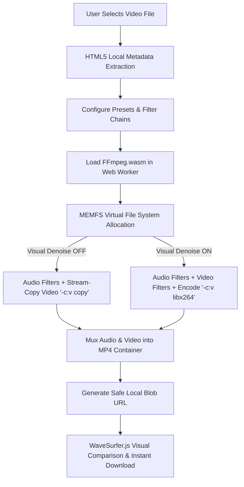

# 🎙️ NoiseGone — High-Performance, Client-Side Video & Audio Noise Reduction

[](https://opensource.org/licenses/MIT)
[](https://vite.dev/)
[](https://ffmpeg.org/)
[](https://github.com/arqam66/noise_reduction)

**NoiseGone** is a professional-grade, fully browser-based web application that removes audio hiss, room reverberation, and video grain from uploaded footage — **100% client-side, with zero server uploads and zero data leaving your device**.

Leveraging **WebAssembly (FFmpeg.wasm)**, the **Web Audio API**, and **Web Workers**, NoiseGone offers studio-quality audio-visual denoising for files up to **1 GB** without requiring user accounts, API keys, or cloud infrastructure.

> **Privacy-First Guarantee:** Your video files never touch external servers. All rendering, filtering, encoding, and muxing occur strictly inside your browser's secure sandbox. You can even run this application entirely offline.

---

## ✨ Key Features & Optimizations

### 🚀 Ultra-Fast Audio Noise Reduction (Video Stream Copying)
When "Visual Noise Reduction" is disabled (or an audio-only preset like **Voice-Only** is selected), NoiseGone automatically bypasses the computationally heavy video re-encoding phase. By applying FFmpeg's stream-copy feature (`-c:v copy`), we:
1. **Dramatically Accelerate Processing:** Denoising completes in **seconds** (up to 50x faster than full re-encoding) because only the lightweight audio track is processed and encoded.
2. **Preserve Video Quality:** The original video stream is copied bit-for-bit, meaning there is **zero video degradation** or quality loss.
3. **Avoid Unnecessary File Size Bloat:** Since the video stream is not re-compressed, the output file size remains nearly identical to the original, only replacing noisy audio with crystal-clear audio.

### 🔊 Double-Layer Vocal & Audio Denoising
To deliver professional, podcast-quality vocals, NoiseGone pairs FFmpeg’s **Adaptive Fast Fourier Transform Denoiser (`afftdn`)** with high-pass and low-pass frequency isolation:
- **AC Hum & Rumble Removal:** A configured **high-pass filter** (`highpass=f=80` or `highpass=f=100`) filters out sub-bass room vibrations, microphone rumblings, and AC electrical humming below vocal ranges.
- **High-Frequency Hiss Suppression:** A configured **low-pass filter** (`lowpass=f=12000` or `lowpass=f=8000`) rolls off annoying electronic whistles, static crackle, and laptop fan noise above vocal ranges.
- **Adaptive Floor Tracking:** FFmpeg's `tn=1` enables active tracking, letting the filter adapt to changing background noise profiles throughout the clip.

---

## 🛠️ System Architecture & Data Flow



1. **MEMFS Sandbox:** The uploaded video file is mounted into an in-memory virtual file system (MEMFS) managed securely by WebAssembly.
2. **Multi-Threaded Execution:** A dedicated worker pool performs complex mathematical operations (Fast Fourier Transforms, temporal smoothing) in parallel.
3. **Local Cleanup:** Upon completing or cancelling, all memory buffers are fully deallocated (`ff.deleteFile`), leaving no residual files in browser memory.

---

## ⚙️ Core Filter & Preset Configurations

The application maps user-facing presets to precisely tuned FFmpeg filter graphs:

| Preset | Audio Filter Pipeline | Video Filter Pipeline | Primary Use Case |
| :--- | :--- | :--- | :--- |
| **🌤 Light** | `highpass=f=80,afftdn=nr=15:nf=-45:tn=1` | `hqdn3d=1:1:2:2` | Quiet room recordings with faint background hum or hiss. |
| **⚡ Standard** | `highpass=f=80,afftdn=nr=25:nf=-40:tn=1,lowpass=f=12000` | `hqdn3d=3:3:6:6` | Default webcam, desk microphone, or typical office background setup. |
| **🔥 Aggressive** | `highpass=f=100,afftdn=nr=35:nf=-35:tn=1,lowpass=f=10000` | `hqdn3d=6:6:10:10` | Outdoor wind noise, loud air conditioners, or highly grainy phone footage. |
| **🎙 Voice-Only** | `highpass=f=100,afftdn=nt=w:nr=30:nf=-35:tn=1,lowpass=f=8000` | *(Video Stream Copy)* | Audio-focused interviews, podcast episodes, and lectures (sharp voice isolation). |
| **🎬 Film Grain** | `highpass=f=80,afftdn=nr=18:nf=-40:tn=1` | `nlmeans=s=3:r=7:p=3` | Vintage camera sensors; gentle audio cleanup paired with advanced visual non-local means. |

---

## 🚀 Local Development & Installation

### Prerequisites
- **Node.js** (v18.0.0 or higher recommended)
- **npm** (v9.0.0 or higher)

### 1. Clone the Repository
```bash
git clone https://github.com/arqam66/noise_reduction.git
cd noise_reduction
```

### 2. Install Project Dependencies
```bash
npm install
```

### 3. Launch Development Server
```bash
npm run dev
```
Open your browser and navigate to `http://localhost:5173`.

### 4. Build for Production
To bundle the React + TypeScript assets into highly optimized static files:
```bash
npm run build
```

---

## 🌐 Production Deployment & Security Headers

Because FFmpeg.wasm relies on `SharedArrayBuffer` for multi-threaded processing, browsers require a high-security context. The hosting CDN or web server **must** serve the application with the following HTTP security headers:

```http
Cross-Origin-Opener-Policy: same-origin
Cross-Origin-Embedder-Policy: require-corp
```

### Configuration Examples for CDNs

#### 1. Vercel (`vercel.json`)
```json
{
  "headers": [
    {
      "source": "/(.*)",
      "headers": [
        { "key": "Cross-Origin-Opener-Policy", "value": "same-origin" },
        { "key": "Cross-Origin-Embedder-Policy", "value": "require-corp" }
      ]
    }
  ]
}
```

#### 2. Netlify (`netlify.toml`)
```toml
[[headers]]
  for = "/*"
  [headers.values]
    Cross-Origin-Opener-Policy = "same-origin"
    Cross-Origin-Embedder-Policy = "require-corp"
```

#### 3. Cloudflare Pages (`_headers`)
Create a `_headers` file in your build output (`dist/`) directory:
```text
/*
  Cross-Origin-Opener-Policy: same-origin
  Cross-Origin-Embedder-Policy: require-corp
```

#### 4. Nginx Configuration (`nginx.conf`)
```nginx
server {
    listen 80;
    server_name yourdomain.com;
    root /usr/share/nginx/html;

    location / {
        add_header Cross-Origin-Opener-Policy "same-origin" always;
        add_header Cross-Origin-Embedder-Policy "require-corp" always;
        try_files $uri $uri/ /index.html;
    }
}
```

---

## 🧠 Memory Management for Large Files (Up to 1 GB)

Browsers limit heap memory allocation per tab. Processing 1 GB files client-side requires rigorous RAM budgeting. NoiseGone uses several advanced techniques to ensure stability:
- **Virtual MEMFS Cleanup:** Deletes both the input stream buffer and output MP4 buffer immediately from WASM memory as soon as the browser download blob is registered.
- **Progressive Chunk Garbage Collection:** Transfers the parsed ArrayBuffers progressively to avoid keeping duplicate representations in both the JavaScript heap and the WebAssembly linear memory simultaneously.
- **Hardware RAM Assessment:** Warns users with less than 8 GB of hardware RAM that processing large clips (>500 MB) with intensive video filtering might exceed system constraints.

---

## 💬 Frequently Asked Questions (FAQ)

#### Q: Is my data safe with NoiseGone?
**A:** Yes. NoiseGone is 100% serverless. Your files are read into local browser memory, filtered via local WebAssembly instructions, and downloaded locally. No analytics, tracking, or telemetry captures your content.

#### Q: Why is visual noise reduction slower than audio?
**A:** Audio waveforms are one-dimensional signals processed very fast via FFT. Video frames are complex 2D grids (millions of pixels per frame) that must be analyzed both spatially (within the frame) and temporally (across multiple frames). This process is highly CPU-intensive inside a sandboxed browser environments.

---

## 👨‍💻 Creator & License

Designed and built with ❤️ by [**arqam66**](https://github.com/arqam66).

Licensed under the [MIT License](LICENSE). Feel free to fork, customize, and build upon this project!
