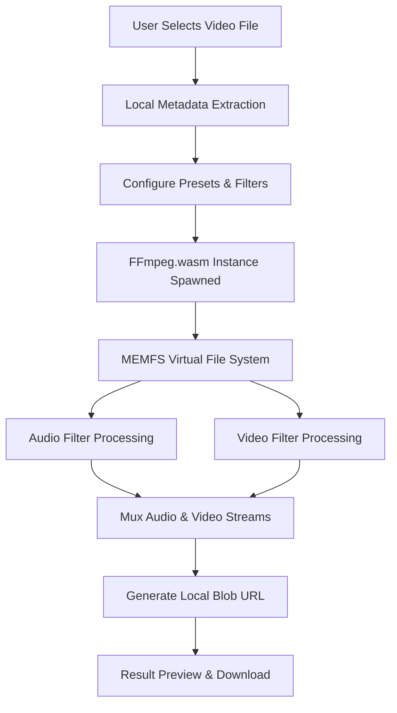

# 🎙️ NoiseGone — Client-Side Video & Audio Noise Reduction Tool

[](https://opensource.org/licenses/MIT)
[](https://vite.dev/)
[](https://ffmpeg.org/)
[](https://github.com/arqam66/noise_reduction)

**NoiseGone** is a professional-grade, fully browser-based web application that removes audio hiss, room reverberation, and video grain from uploaded footage — **100% client-side, with zero server uploads**.

Leveraging **WebAssembly (FFmpeg.wasm)**, **Web Audio API**, and **Web Workers**, NoiseGone offers studio-quality audio-visual denoising for files up to **1 GB** without requiring accounts, API keys, or cloud infrastructure.

> **Privacy-First Promise:** Your video files never leave your computer. All rendering, processing, and encoding occur entirely inside your browser's sandboxed environment. You can even run this application completely offline.

---

## ✨ Features

- **Double-Layer Denoising**: Independent filters for cleaning up background audio noise (hum, hiss, fans) and visual video noise (digital sensor noise, low-light grain).
- **Optimized Presets**:
  - **Light**: For high-quality recordings with minor static/hiss.
  - **Standard**: The default setting for webcams and standard microphones.
  - **Aggressive**: Heavy background attenuation and visual cleanup.
  - **Voice-Only**: High pass filtering and fast-Fourier transforms optimized for vocals and speech.
  - **Film Grain**: Gentle audio cleanup with advanced non-local means (`nlmeans`) video smoothing.
- **Advanced Options**: Directly tweak FFmpeg filter parameters (e.g., FFT noise reduction strength, spatial/temporal parameters) for custom workflows.
- **Local Waveform Preview**: Inspect before-and-after audio dynamics using browser-native waveforms.
- **Responsive & Modern UI**: Built with React, Tailwind CSS, featuring glassmorphism accents, progress metrics, and live ETA estimation.

---

## 🛠️ Architecture & Under the Hood



1. **MEMFS Virtual Filesystem**: Input files are written directly into a virtual, memory-backed file system (MEMFS) managed by WebAssembly.
2. **Multi-Threaded Processing**: Spawns Web Workers via browser-based worker pools to perform heavy mathematical operations (Fast Fourier Transforms, temporal smoothing) in parallel.
3. **Cross-Origin Security Headers**: Because FFmpeg.wasm requires `SharedArrayBuffer` for multi-threading, the hosting server must supply custom COOP (`Cross-Origin-Opener-Policy`) and COEP (`Cross-Origin-Embedder-Policy`) headers to isolate the context safely.

---

## 🚀 Local Development & Setup

### Prerequisites
- **Node.js** (v18 or higher recommended)
- **npm** or **yarn**

### 1. Clone the Repository
```bash
git clone https://github.com/arqam66/noise_reduction.git
cd noise_reduction
```

### 2. Install Dependencies
```bash
npm install
```

### 3. Run the Development Server
```bash
npm run dev
```
Open your browser and navigate to `http://localhost:5173`.

> [!WARNING]
> **Important Note for Local Dev / Production Hosting:**
> To allow WebAssembly multi-threading, the server must respond with the following headers:
> - `Cross-Origin-Opener-Policy: same-origin`
> - `Cross-Origin-Embedder-Policy: require-corp`
>
> In development mode, Vite is pre-configured with these headers in `vite.config.ts`. If you are deploying to Netlify, Vercel, GitHub Pages, or a custom Nginx server, you must configure these headers in your respective configuration files (e.g., `netlify.toml`, `vercel.json`, or `.htaccess`).

---

## ⚙️ Core Filter Technical Configuration

Under the hood, NoiseGone maps presets to specific FFmpeg command-line filters:

| Preset | Audio Filter Command | Video Filter Command | Primary Use Case |
| :--- | :--- | :--- | :--- |
| **Light** | `afftdn=nf=-20` | `hqdn3d=1:1:2:2` | Low-level hiss, quiet room |
| **Standard** | `afftdn=nf=-30` | `hqdn3d=3:3:6:6` | Default webcam & mic setup |
| **Aggressive** | `afftdn=nf=-50` | `hqdn3d=6:6:10:10` | Outdoor wind, loud AC, high grain |
| **Voice-Only** | `afftdn=nf=-40:nt=w` | *(Passthrough)* | Podcasting, voiceovers, lectures |
| **Film Grain** | `afftdn=nf=-25` | `nlmeans=s=3:r=7:p=3` | Vintage camera sensor, high-quality denoising |

---

## 💬 Frequently Asked Questions (FAQ)

#### Q: Are my files uploaded to a server?
**A:** No. NoiseGone runs entirely in your browser. No files, metadata, or media streams are transmitted over the network. You can disconnect your internet and the application will continue to function.

#### Q: What is the maximum file size?
**A:** The application enforces a **1 GB limit**. Since video files are loaded directly into browser memory (RAM) for processing, large files can crash browser tabs on devices with low memory. We recommend having at least 8 GB of RAM for files larger than 500 MB.

#### Q: Why is visual noise reduction significantly slower than audio?
**A:** Audio filters analyze waveforms, which is computationally lightweight. Video filters must analyze, compare, and modify pixel grids across multiple frames temporally and spatially. Rendering frames within a sandboxed WebAssembly environment has an inherent performance overhead compared to native desktop applications.

#### Q: Which browsers are supported?
**A:** Any modern browser supporting WebAssembly, Web Workers, and SharedArrayBuffer:
- Google Chrome / Chromium-based browsers (Edge, Opera, Brave)
- Mozilla Firefox
- Apple Safari (Desktop)

---

## 👨‍💻 Created By

NoiseGone was developed with ❤️ by **arqam66**.

- **GitHub**: [@arqam66](https://github.com/arqam66)
- **Repository**: [arqam66/noise_reduction](https://github.com/arqam66/noise_reduction)

---

## 📄 License

This project is licensed under the MIT License. See the [LICENSE](LICENSE) file for details.
